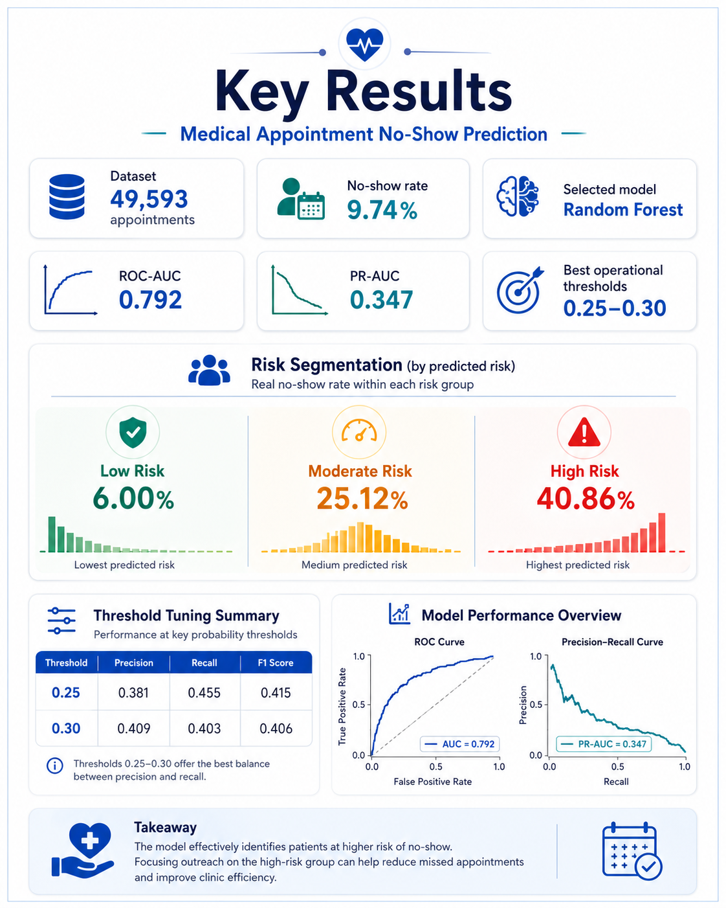
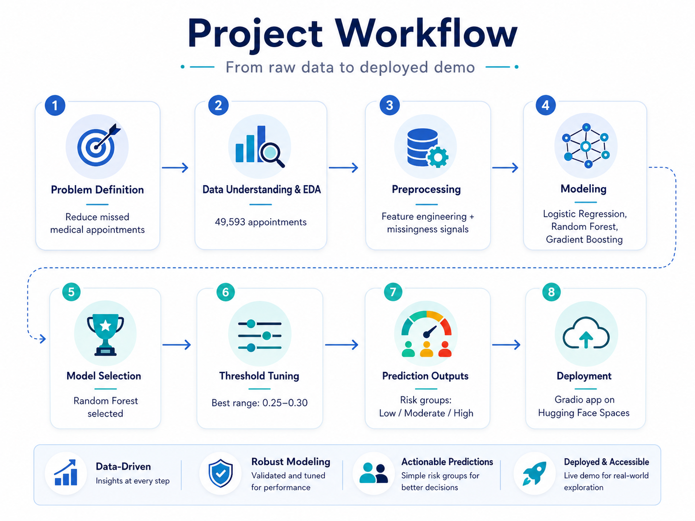

# Medical Appointment No-Show Risk Predictor

An end-to-end machine learning project that predicts the risk of patients missing scheduled medical appointments and turns model probabilities into actionable risk segments.

## Live Demo

Try the deployed Gradio application on Hugging Face Spaces:

### Model Artifact

The serialized trained model artifact is not included in this GitHub repository due to GitHub's file size limits.  
The fully deployed application, including the trained model, is available through the live Hugging Face Space:


[Open the Medical No-Show Risk Predictor](https://huggingface.co/spaces/zehraerdogan1004/medical-no-show-risk-predictor)

---

## Problem

Missed medical appointments create operational inefficiency, waste clinical capacity, and delay access to care for other patients.

This project addresses the question:

> **Can we identify appointments with elevated no-show risk before they happen, and translate those predictions into practical risk groups for intervention?**

Rather than stopping at model training, the project builds a full workflow from raw healthcare appointment data to a deployed decision-support demo.

---

## Project Highlights

- Worked with **49,593 medical appointments**
- Built an end-to-end workflow:
  - Data understanding and exploratory analysis
  - Feature engineering and preprocessing
  - Imbalanced classification modeling
  - Threshold tuning
  - Prediction output generation
  - Gradio deployment on Hugging Face Spaces
- Compared:
  - Logistic Regression
  - Random Forest
  - Gradient Boosting
- Selected **Random Forest** as the main model
- Converted model probabilities into:
  - **Low Risk**
  - **Moderate Risk**
  - **High Risk**

---

## Key Results



### Selected Model: Random Forest

| Metric | Score |
|---|---:|
| ROC-AUC | 0.792 |
| PR-AUC | 0.347 |

### Threshold Tuning

| Threshold | Precision | Recall | F1-score |
|---|---:|---:|---:|
| 0.25 | 0.381 | 0.455 | 0.415 |
| 0.30 | 0.409 | 0.403 | 0.406 |

The default `0.50` classification threshold was too conservative for this imbalanced healthcare problem. A threshold between **0.25 and 0.30** produced a more useful operational balance.

---

## Risk Segmentation

The selected model generated practically meaningful risk groups on the test set:

| Risk Group | Actual No-Show Rate |
|---|---:|
| Low Risk | 6.00% |
| Moderate Risk | 25.12% |
| High Risk | 40.86% |

This means that appointments classified as **High Risk** were far more likely to result in a missed visit than appointments classified as **Low Risk**.

---

## Project Workflow



---

## Data Insights

Exploratory analysis revealed several patterns associated with missed appointments:

- **Heavy cold days** showed a higher no-show rate than mild days.
- No-show rates increased slightly as **rain intensity** increased.
- Missing values in fields such as:
  - `specialty`
  - `city`
  - `disability`
  - `age`
  - weather measurements  
  were themselves associated with higher no-show rates.
- The **2–5 age group** showed a notably high no-show rate.
- Friday appointments had a higher no-show rate than several other weekdays.

These findings shaped the feature engineering and model interpretation stages.

---

## Modeling Approach

### Models Tested

1. **Logistic Regression**
   - Strong recall for no-show cases
   - Very low precision

2. **Random Forest**
   - Best overall discrimination
   - Highest ROC-AUC and PR-AUC
   - Most useful after threshold tuning

3. **Gradient Boosting**
   - Weak performance for the minority class in this setup

### Final Model Choice

**Random Forest** was selected because it provided the strongest overall ranking ability and supported meaningful threshold tuning for operational use.

---

## Feature Interpretation

Permutation importance suggested that the most influential predictors included:

- Appointment month
- Appointment year
- City
- Appointment hour
- Age
- Day of the week
- Temperature-related variables

This indicates that no-show risk is influenced by a combination of:

- Temporal patterns
- Geographic context
- Patient characteristics
- External conditions

---

## Deployment

The final model pipeline was saved and deployed through a **Gradio** interface on **Hugging Face Spaces**.

The app allows users to enter appointment, patient, and weather-related information and returns:

- Predicted no-show probability
- Risk level
- Suggested follow-up action

---

## Repository Structure

```text
health_no_show_project/
├── app/
│   └── app.py
├── assets/
│   ├── hero.png
│   ├── key_result.png
│   └── workflow.png
├── data/
│   ├── medical-appointments-no-show-en.csv
│   └── medical_no_show_preprocessed.csv
├── models/
│   └── random_forest_no_show_pipeline.joblib
├── notebooks/
│   ├── 01_data_understanding.ipynb
│   ├── 02_exploratory_data_analysis.ipynb
│   ├── 03_preprocessing.ipynb
│   ├── 04_modeling.ipynb
│   └── 05_prediction_outputs.ipynb
├── outputs/
│   ├── no_show_prediction_outputs.csv
│   ├── no_show_dashboard_dataset.csv
│   └── risk_level_summary.csv
├── space/
│   ├── README.md
│   ├── app.py
│   ├── requirements.txt
│   └── models/
│       └── random_forest_no_show_pipeline.joblib
├── requirements.txt
└── README.md
